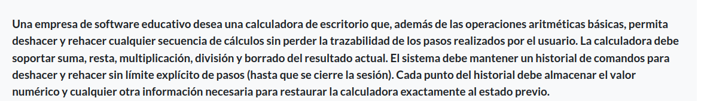
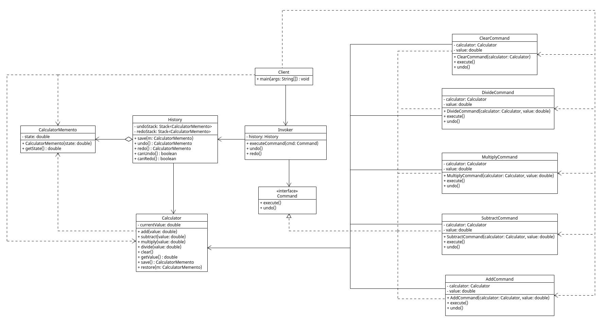

# 🧮 Calculadora con Deshacer/Rehacer usando Command y Memento

Este proyecto implementa una **calculadora de escritorio en Java** que soporta operaciones básicas (suma, resta, multiplicación, división y borrado del resultado) con la funcionalidad adicional de **deshacer** y **rehacer** cualquier secuencia de cálculos, manteniendo la trazabilidad total de los pasos.

Según el problema:

***

## Grupo 1 (Integrantes)

* Juan Sebastian Vega Diaz 20231020087
* Felipe Cardenas Mora 20231020145
* Yuber Alejandro Bohorquez Roa 20231020195
* David Neira 20192020086
* Juan Felipe Chibuque López 20232020093

***

## UML Memento

***

## 🎯 Patrones de diseño aplicados

El diseño está basado en la integración de **dos patrones de comportamiento clásicos**:

### 🧠 Memento

Permite almacenar y restaurar el estado de la calculadora, haciendo posible el **deshacer (undo)** y **rehacer (redo)** múltiples pasos.

### ⚙️ Command

Encapsula cada operación aritmética como un objeto comando, lo que permite ejecutar, deshacer y componer comandos fácilmente.

***

## 🧩 Estructura general del sistema

### 📦 Clases principales y sus roles

| Clase              | Rol                         | Patrón        |
|-------------------|-----------------------------|---------------|
| `Calculator`       | Receiver + Originator       | Command + Memento |
| `CalculatorMemento` | Memento                     | Memento       |
| `History`          | Caretaker                   | Memento       |
| `Command` (interface) | Abstracción comando       | Command       |
| `AddCommand`, etc. | ConcreteCommand             | Command       |
| `Invoker`          | Invocador de comandos       | Command       |
| `Client`           | Configura y orquesta        | Ambos         |

***

## 🔗 Relación entre clases (según UML)

### 🔹 Memento

* `Calculator` **crea y restaura** objetos `CalculatorMemento` temporalmente, por lo tanto tiene una **dependencia** (`..>`) con `CalculatorMemento`.
* `History` **almacena mementos** en pilas `undoStack` y `redoStack`, pero **no los crea ni los destruye**, por lo tanto su relación con `CalculatorMemento` es una **agregación** (`o--`).
* `History` necesita invocar `save()` y `restore()` del `Calculator`, por lo que idealmente debería tener una **asociación directa** (`-->`) con este.

### 🔹 Command

* `Command` es una **interfaz** con `execute()` y `undo()`, y es **heredada** (`<|--`) por todas las clases concretas (`AddCommand`, `SubtractCommand`, etc.).
* Cada `ConcreteCommand` mantiene una **asociación directa** (`-->`) con `Calculator`, ya que opera sobre él y guarda esa referencia como atributo.
* `Invoker` tiene una **asociación fuerte** (`-->`) con `Command`, ya que lo recibe y ejecuta.
* `Invoker` también tiene una **asociación** con `History`, ya que gestiona `undo()` y `redo()` a través de ella.
* `Client` **crea e inyecta** todos los elementos del sistema, por lo tanto tiene **dependencias** (`..>`) con `Calculator`, `Invoker` y cada `ConcreteCommand`.

***

## 🔁 Flujo de ejecución

1. El `Client` instancia el `Calculator`, el `Invoker` y un `ConcreteCommand` como `AddCommand`.
2. El `Client` entrega el comando al `Invoker`.
3. El `Invoker` ejecuta el comando, que modifica el estado del `Calculator`.
4. Antes de cada cambio, el `Invoker` le pide al `Calculator` un `CalculatorMemento` y lo guarda en el `History`.
5. Si el usuario desea deshacer una operación, el `Invoker` solicita al `History` el último `CalculatorMemento` y se lo pasa al `Calculator` para restaurar su estado.

***

## 📌 Ventajas de este diseño

* Separa claramente las responsabilidades (abierto a extensión, cerrado a modificación).
* Permite una fácil adición de nuevas operaciones.
* El historial no depende de cómo se implementan los comandos ni de cómo funciona internamente la calculadora.
* El flujo de deshacer y rehacer es independiente de la lógica de negocio.

***

## 📎 Conclusión

Este diseño modular permite **extensibilidad**, **mantenibilidad** y una clara **separación de responsabilidades**, facilitando futuras mejoras como una interfaz gráfica o más tipos de operaciones. Además, es una implementación fiel a los patrones de diseño originales de GoF.
